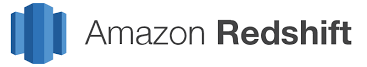
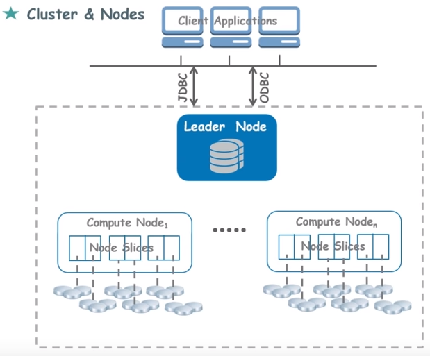

<p align="center">
    
</p>


This repo is a concise summary and _replacement_ of the [Amazon Redshift by Edureka](https://www.youtube.com/watch?v=fc5WPKnbam8) tutorial. Using the hyperlinks below is optional.


# [Tutorial by Edureka](https://www.youtube.com/watch?v=fc5WPKnbam8)

[What is a data warehouse?](https://youtu.be/fc5WPKnbam8?t=75) - a repository where data generated from your organization's operational systems is collected, transformed, and stored.

[What is Redshift?](https://youtu.be/fc5WPKnbam8?t=349) - a parallel, column-oriented database for analyzing data in your data warehouse.

[What are clusters and nodes?](https://youtu.be/fc5WPKnbam8?t=381) - _nodes_ are a collection of compute resources. A group of nodes is called a _cluster_. Each cluster runs a Redshift engine, and it contains 1+ databases.



[What is a leader node?](https://youtu.be/fc5WPKnbam8?t=397) - receives queries from client applications. It coordinates the parallel execution of a query using 1+ compute nodes. The leader node also aggregates the results from the compute nodes and sends it back to the client appliation.

[What is a compute node?](https://youtu.be/fc5WPKnbam8?t=422) - compute resources that are used to process queries that the _leader node_ sends it. Compute nodes can transfer data amongst themselves to solve queries.

[What are node slices?](https://youtu.be/fc5WPKnbam8?t=435) - _compute nodes_ are divided into _node slices_. Each slice receives memory and disk space. Slices work in parallel to perform operations.

[How do clients communicate with Redshift?](https://youtu.be/fc5WPKnbam8?t=466) - client applications  communicate with the _Leader Node_ using either:

1. JDBC (Java Database Connectivity Driver) - an API for Java, or
1. ODBC (Other Database Connectivity Driver) - uses SQL to interact with Leader Node

[What are some settings you select during Redshift cluster creation?](https://youtu.be/fc5WPKnbam8?t=598) - type of node you want, number of nodes, the VPC where you want to create your data warehouse, etc.

[How does Redshift autoscale up and down?](https://youtu.be/fc5WPKnbam8?t=657) - it just increases or lowers the number of compute nodes.

[Is Redshift row or column storage?](https://youtu.be/fc5WPKnbam8?t=730) - column storage.

[What are some benefits of column storage?](https://youtu.be/fc5WPKnbam8?t=817) Since the data is stored next to each other, we get:
1. Improved Data compression
1. Faster queries and updates on columns

[What is a Data Lake?](https://youtu.be/fc5WPKnbam8?t=962) - a storage repository that holds a vast amount of raw data in it's native format until it's needed (CSV, Parquet, TSV, RCFile, etc.)

[What is ETL?](https://youtu.be/fc5WPKnbam8?t=977) - A sample ETL is when you _Extract, Transform, Load_ data from a data lake into Redshift. This is time-consuming, compute-intensive, and costly (due to the need of growing your clusters in Redshift).

[What is _Amazon Redshift Spectrum_?](https://youtu.be/fc5WPKnbam8?t=1012) - Instead of doing ETL jobs, you can use _Amazon RedShift Spectrum_ to directly query data in s3 or a data lake, without unnecessary data movement.

[How is data backed up in Redshift?](https://youtu.be/fc5WPKnbam8?t=1034) - Redshift offers backup and recovery. As soon as data is stored in Redshift, a copy of that data is sent to s3 through a secure connection. If you lose your data, you can restore it easily using s3.

[Does Redshift provide encryption?](https://youtu.be/fc5WPKnbam8?t=1059) - yes.

[What software do you need to install to use Redshift?](https://youtu.be/fc5WPKnbam8?t=1097)

1. SQL Workbench - this is where you do queries
1. JDBC Driver - enables the client application to communicate with Redshift
1. Also, Java Runtime should be enabled on your OS

[How create a Redshift cluster in AWS Console?](https://youtu.be/fc5WPKnbam8?t=1230) - in the AWS Console, go to _Amazon Redshift_ and click _Quick launch cluster_ (fastest way) or _Launch cluster_ (more versatile way)

[When creating a Redshift cluster, what is the default port?](https://youtu.be/fc5WPKnbam8?t=1348) - they set it to `5439` for us. We use this port number later.

[How is a database created in Redshift?](https://youtu.be/fc5WPKnbam8?t=1459) - when we used the "Quick launch cluster" option, a default database called `dev` is created for us.

[What URL does SQL workbench need to connect to the cluster](https://youtu.be/fc5WPKnbam8?t=1571) - either a JDBC URL or ODBC URL. Both can be found in AWS Console's Redshift dashboard, under _Clusters_.

[How create tables in Redshift?](https://youtu.be/fc5WPKnbam8?t=1669) - can use a sample database from AWS documentation (which is a bunch of `create table` commands to copy/paste)

[How copy data for a database from s3 into Redshift?](https://youtu.be/fc5WPKnbam8?t=1742)

You can do something like:

```sql
copy users from 's3://awssamplebuswest2/tickit/allusers_pipe.txt'
credentials 'aws_iam_role=<iam-role-arn>'
delimiter '|' region 'us-west-2';
```
- This copies to the table `users` from a given path.
- You also have to provide an IAM role as credentials
- The `delimiter` is what separates the fields of the columns
- `region` is where your s3 bucket is located

[How perform queries on this new data?](https://youtu.be/fc5WPKnbam8?t=1878) - use SQL workbench.

[How see previous queries you've performed?](https://youtu.be/fc5WPKnbam8?t=1981) - In AWS Console, go to your Redshift cluster and click the _Queries_ tab.


# More Notes

__How much data should you have for Redshift to be a good idea?__ - 100 GB or more. Otherwise, use MySQL.

__Is Redshift good for BLOB data?__ - No. Use s3 instead.

__How is backup/restore achieved?__ The _compute nodes_ asynchronously backup to s3 (currently this is every 5 GB of changed data, or 8 hours)

__What is the primary goal when distributing data across nodes?__ - to distribute the data evenly. This maximizes parallel processing.

__What are the distribution styles: DISTKEY, ALL, EVEN?__

1. DISTKEY - hashes a key to distribute data.
1. ALL - puts a copy of the table on every node.
1. EVEN - splits a table evenly across 2+ nodes

__What's the best distribution style (DISTKEY, ALL, EVEN) for small tables?__ - ALL. For scenarios where a big table is being joined with a small table, it's beneficial that the small table exists on the same node, so no data transfer happens between nodes.

__If JOINs are being performed often on a column (that has distinct values), how should you distribute data?__ - DISTKEY will evenly distribute the data across nodes. In addition, since JOINs are being performed often on a certain column, using that column as the key will spread out that column's data evenly across nodes.

__What if you have a huge table, and Column1 and Column2 are each accessed 50% of the time? How can you do distribution?__ - Create 2 of this table, one with a DISTKEY for Column1, and one with a DISTKEY for Column2.

__When do you use the EVEN distribution style?__ - when you have no insights into the data, or which columns are accessed frequently, you can just distribute the data evenly across the nodes.

__Does Redshift enforce primary key or foreign keys?__ - No, but defining them can speed up queries.

__What's a good way to copy data into redshift, using files?__ - Instead of using 1 big file, split the data into multiple files and use 1 COPY command to copy data from multiple files. Each slice in a node will process 1 file, so if you have 960 slices, use 960 files.

__What is _vacuuming_?__ - When you perform a delete, rows are marked for deletion, but not removed. Redshift automatically runs a [VACUUM DELETE](https://docs.aws.amazon.com/en_pv/redshift/latest/dg/t_Reclaiming_storage_space202.html) operation (during periods of reduced load) to actually delete this rows.

__Instead of deleting old data, what's a better idea?__ - Deleting data causes _vacuuming_, which is slow (could take hours). Instead, split the data into tables by time (such as month). You can delete old data by simply using `DROP TABLE` on the table.

__What are subqueries? When are they okay to use?__ - A subquery is a query within a query. Use subqueries in cases where one table in the query is used only for predicate conditions. A subquery in a query results in nested loops, so only use it when a subquery returns a small number of rows (like less than 200).

__What are blocks?__ - Column data is persisted to 1 MB immutable blocks. When factoring in compression, there can be 1 million values in a single block.

__What is a Redshift Sort Key?__ - [Redshift Sort Key determines the order in which rows in a table are stored. Query performance is improved when Sort keys are properly used as it enables query optimizer to read fewer chunks of data filtering out the majority of it.](https://hevodata.com/blog/redshift-sort-keys-choosing-best-sort-style/)

# References

### References - Used in this repo

- Youtube: [Amazon Redshift Tutorial | AWS Tutorial for Beginners | AWS Certification Training | Edureka](https://www.youtube.com/watch?v=fc5WPKnbam8) - good beginner tutorial.

### References - Deprecated

- YouTube: [Deep Dive on Amazon Redshift - AWS Online Tech Talks](https://www.youtube.com/watch?v=Hur-p3kGDTA) - advanced, high-level tutorial for users who already know Redshift. Mediocre.
- A Cloud Guru: [Hands on with AWS Redshift: Table Design](https://learn.acloud.guru/course/aws-redshift-table-design/dashboard) - assumes AWS Knowledge (Security Groups, VPC, etc.). Everything starting from "Load data and run sql queries" was not well explained. Very confusing tutorial.
